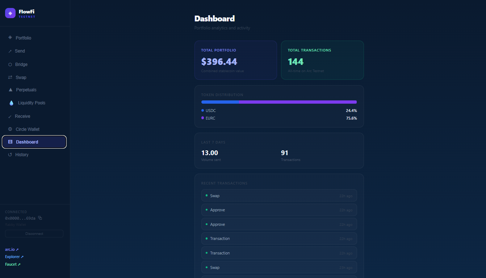
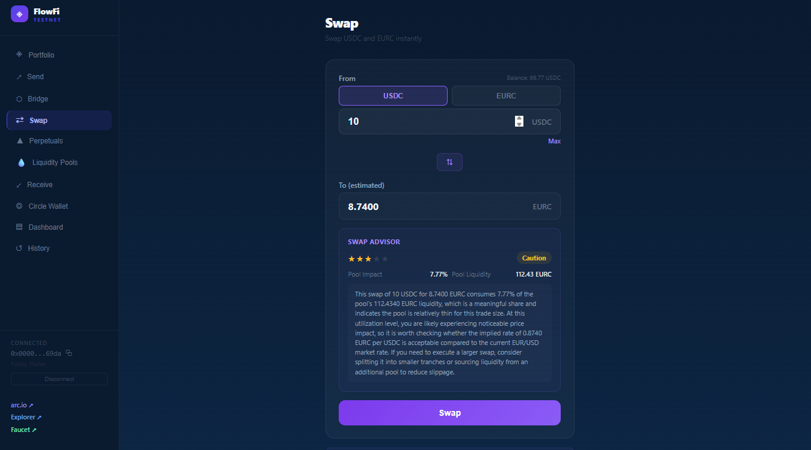
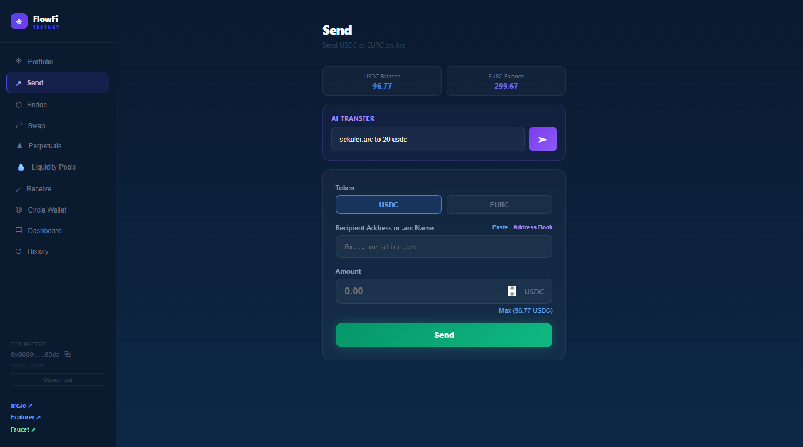
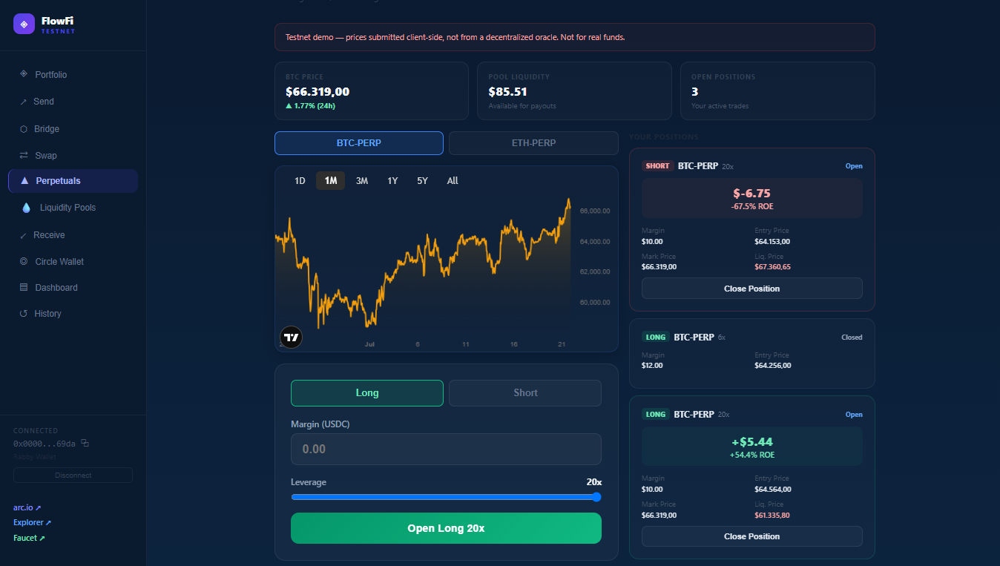

# FlowFi

**Your stablecoin financial layer on Arc.**

FlowFi is an AI-powered financial operating system for Arc, combining payments, swaps, perpetuals, liquidity, and escrow into a single application backed by real on-chain smart contracts. Every feature below is deployed and verifiable — no mocked data, no simulated transactions.

🔗 **Live demo:** [flowfi-arc.vercel.app](https://flowfi-arc.vercel.app)
📦 **GitHub:** [github.com/sekuler/flowfi](https://github.com/sekuler/flowfi)

---

## Screenshots

| Dashboard | Swap |
|---|---|
|  |  |

| AI-Assisted Send | Perpetuals |
|---|---|
|  |  |

---

## Features

| Feature | What it does |
|---|---|
| **Portfolio** | USDC, EURC, USYC balances with live USD equivalents, plus unified cross-chain USDC balance across Arc, Ethereum Sepolia, Base Sepolia, and Arbitrum Sepolia |
| **Send** | Natural-language transfers ("send 20 USDC to alice.arc"), ArcNS name resolution, address book |
| **Bridge** | Real CCTP V2 cross-chain USDC transfer — burn/attest/mint via Circle's official TokenMessengerV2, no wrapped tokens |
| **Swap** | On-chain USDC/EURC swap with an AI advisor that reads live pool liquidity and computes a risk score before every trade |
| **Perpetuals** | Long/short BTC and ETH with 1x-20x leverage, live TradingView charts, real-time PNL, liquidation price |
| **Liquidity Pools** | Permissionless AMM factory — anyone can create a pool for any token pair and earn a share of swap fees |
| **Escrow** | Smart-contract-secured freelance payments — funds release only when work is delivered |
| **AI Wallet Narrator** | Ask questions about your on-chain activity, answered from your real transaction history |
| **Dashboard** | Portfolio value, token distribution, weekly volume, recent transactions |

---

## Architecture

```
┌─────────────────────────────────────────────┐
│                  FlowFi UI                    │
│         React + Vite + viem + TypeScript      │
└───────────────────┬───────────────────────────┘
                     │
       ┌─────────────┼─────────────────┐
       │             │                 │
┌──────▼──────┐ ┌────▼─────┐  ┌────────▼────────┐
│  Arc Testnet │ │ Circle    │  │  Claude AI      │
│  Contracts   │ │ CCTP V2   │  │  (transfers,    │
│              │ │ Bridge    │  │  swap advisor,  │
│ ArcSwap      │ │           │  │  wallet Q&A)    │
│ ArcEscrow    │ └───────────┘  └─────────────────┘
│ ArcPerps     │
│ ArcFactory   │
└──────────────┘
```

## Tech Stack

- **Frontend:** React, Vite, TypeScript, viem
- **Smart contracts:** Solidity, deployed on Arc Testnet
- **Bridging:** Circle CCTP V2 (TokenMessengerV2 / MessageTransmitterV2)
- **AI:** Claude (Anthropic API) for natural-language transfers, swap risk analysis, and wallet activity Q&A
- **Charts:** TradingView widget
- **Naming:** ArcNS for human-readable address resolution
- **Hosting:** Vercel

## Deployed Contracts (Arc Testnet)

| Contract | Purpose |
|---|---|
| ArcSwap | Fixed-rate USDC/EURC swap |
| ArcEscrow | Conditional freelance payments |
| ArcPerps | Leveraged BTC/ETH trading |
| ArcFactory | Permissionless AMM pool creation |

All contract addresses and transaction history are verifiable on [Arc Testnet Explorer](https://testnet.arcscan.app).

---

## Roadmap

- Circle Developer-Controlled Wallets for seed-phrase-free onboarding
- Lending & borrowing markets on top of the AMM factory
- Decentralized price oracle for Perpetuals
- Mainnet-track hardening (audits, production wallet security)

---

## Running Locally

```bash
npm install
npm run dev
```

Requires a `.env` file with `VITE_ANTHROPIC_KEY` for AI features.

---

Built for the [Encode Club x Circle Programmable Money Hackathon](https://www.encodeclub.com/programmes/arc-hackathon).
